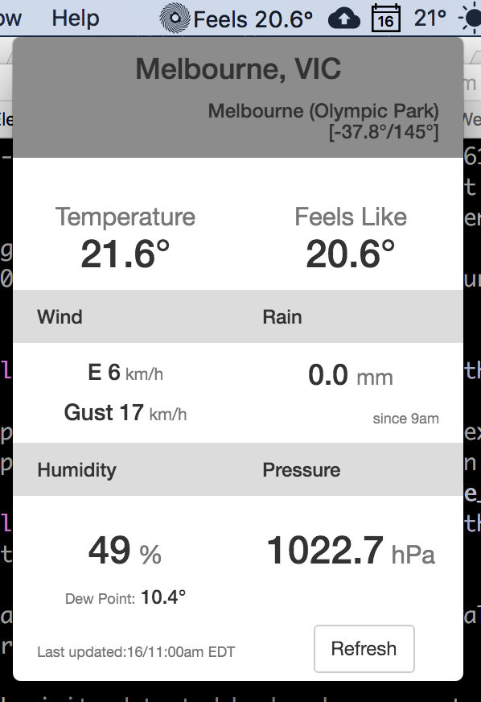
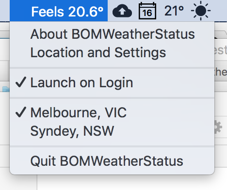
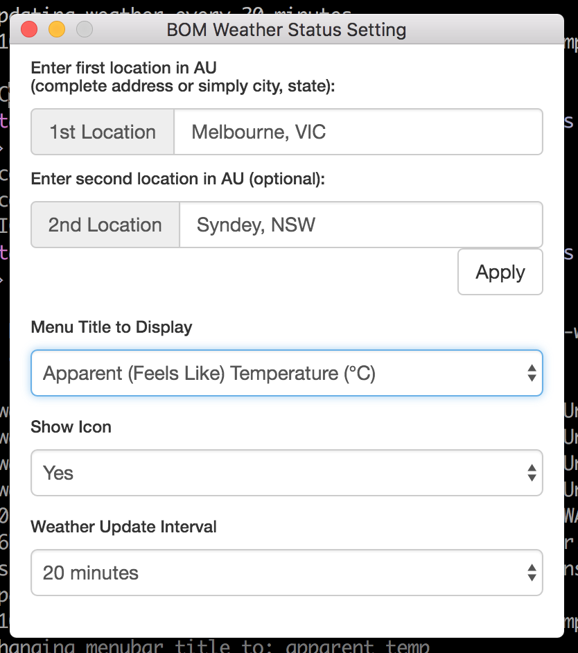
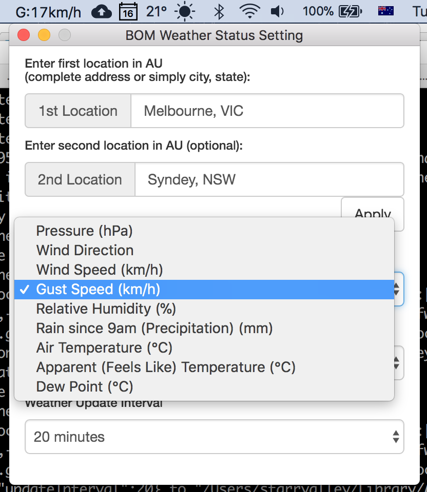

# BOM Weather Status
BOM Weather Status reads current weather observation data from [BOM Australia](http://www.bom.gov.au) and displays a specific data on the status (menu) bar of the OS.

User can choose what data to be placed on the status bar. For example, air temperature, relative humidity, precipitation, wind direction, speed or gust, etc.

**Melbourne current weather**



**Right-click menu**



**Setting window**



**Changing what to show in menubar**




## Weather Data Source

The data source is BOM's [Weather Data Services](http://www.bom.gov.au/catalogue/data-feeds.shtml#obs-ind). It's __limited to Australia__.

## Data Copyright Notice

The weather observation data is limited to Australia. All data obtained are from BOM. See BOM's [Copyright Notice](http://reg.bom.gov.au/other/copyright.shtml). 

## User Location Lookup

User location lookup is made possible by [Google Geocoding API](https://developers.google.com/maps/documentation/geocoding/intro) in the following procedure:

1. User inputs the location in Australia. It can be just a city name, or a city name followed by Australian state, or a complete address to get a better estimate.
2. Google Geocoding API will determine the latitude and longitude of the user location.
3. [BOM place search page](http://www.bom.gov.au/places/search/?q=) can then take the latitude and longitude and find the nearest observation station.
4. BOM Weather Status will then take the weather data from the nearest observation station.

## How to Run
After cloning the repo, install dependencies

```$ npm install```

Then run with

```$ npm test```


## Platform support

Currently this app only runs on MacOS with full functions. 

On Windows 10, no icon appears and I have completely no idea how to fix it. I don't use Windows so just leave it as is.

On Ubuntu Linux (tested on 17.10 with gnome 3.26):
1. I have to `export XDG_CURRENT_DESKTOP=Unity` for the icon to appear
2. No Icon text is supported so there is not much use for this app
3. "left" click on icon event is ignored so both left/right click on the icon will only show the menu.

Due to 3, actually the main weather info window is never shown. Because of this, I added a menu item in the first place so user can actually open the main window which is 2 clicks away. Not much of a point of using this, thought... 

So I would say this app is only useful on MacOS.


